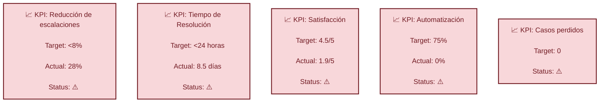
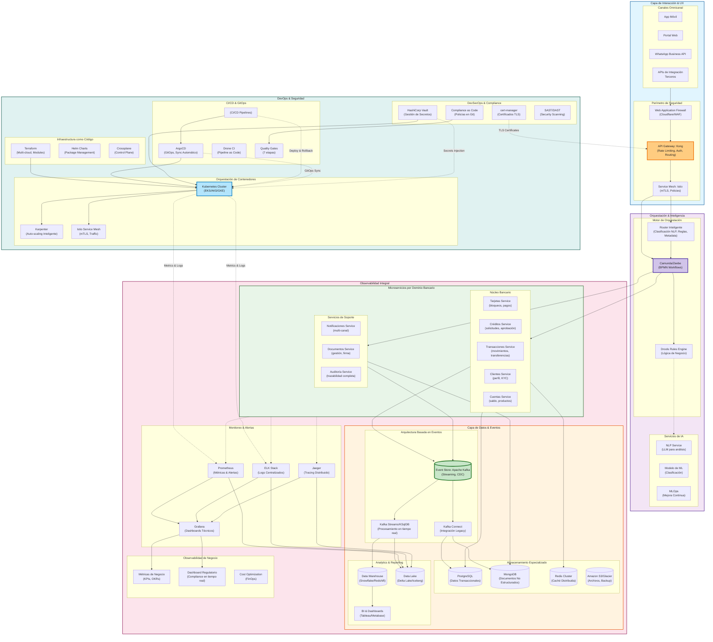
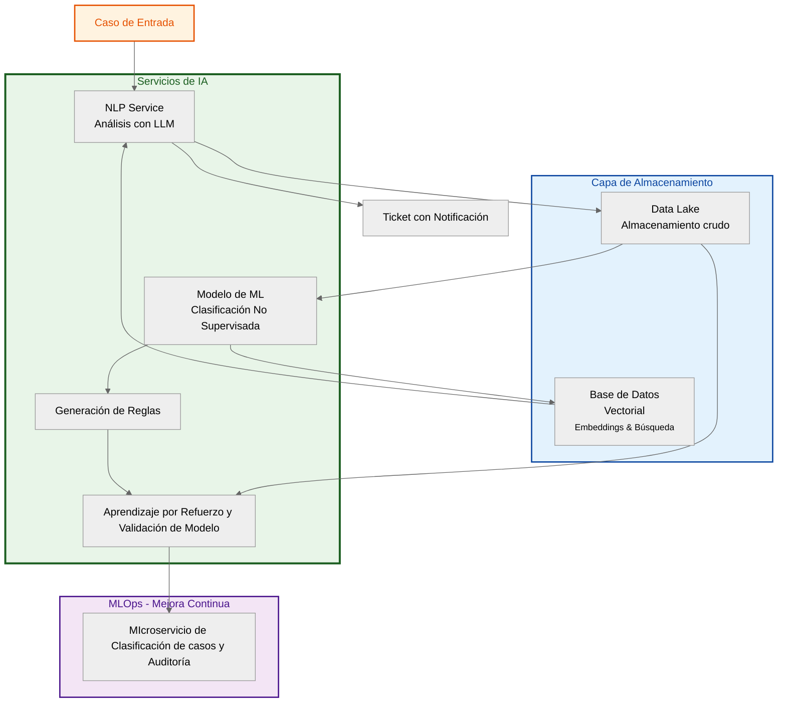
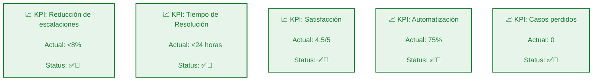

# **Propuesta Sito Bank**
## **1. Análisis**
### KPIs actuales

### Limitaciones Identificadas

   - Regulatorios (trazabilidad, auditabilidad)
   - Técnicos (escalabilidad, integración)
   - Temporales (12 meses para implementación)

### Necesidades por Stakeholder   

| Stakeholder        | Principales intereses                          |
|--------------------|-----------------------------------------------|
| **Superintendencia** | Compliance, seguridad, auditoría              |
| **Clientes**         | Velocidad, transparencia, facilidad           |
| **Operaciones**      | Mantenibilidad, curva de aprendizaje          |

## **2. Principios arquitectónicos**
- Arquitectura Basada en eventos (Event-Driven Architecture).
- Microservicios especializados por dominio bancario.

### Objetivo:
Tener una arquitectura resiliente, escalable, segura, mantenible e integrable con sistemas legacy  y con capacidad de genrar trazabilidad de cada evento pra los cumplientos regulatorios propios de la industria

### **Diagrama 1**. Arquitectura basada en eventos y microsercvicios propuesta para Sito Bank.

### **Diagrama 2.** Vista detallada de microservicio de inteligencia para Sito Bank.

## **3. Flujos críticos**
Con la implementación de la anterior arquitectura se espera respecto a los flujos críticos:
- Bloqueo de tarjeta completamente automatizado.
- Aprobación de créditos de forma semiautomatizada con validación humana.
- Reclamos por transacción no reconocidas con intervención humana mínima.

## **4. Implementación por fases**
### Fase 1. Mes 1-3: seguridad desde el diseño
1. Implementar CI/CD pipeline.
2. Desplegar plataforma de observabilidad.
3. Desarrollar microservicios de cuentas y transacciones.
5. Crear API Gateway básico.
6. Inicio de plan de capacitación y calificación personal.

### Fase 2. Mes 4-6: Expansión
1. Migrar flujos de alto volumen (consultas de saldo).
2. Implementar sistema de eventos.
3. Desarrollar dashboard de monitoreo en tiempo real.
4. Auditorías internas debidamente documentadas y dispuestas para midelos de ML.
5. Entrenar primeros modelos de ML.

### Fase 3. Mes 7-9 : Consolidación
1. Automatizar 60% de flujos.
2. Implementar trazabilidad completa.
3. Conectar todos los canales (app, web, WhatsApp).
4. Capacitación y calificación de equipos operativos.

### Fase 4. Mes 10-12: Optimización
1. Alcanzar 75% automatización.
2. Sistema de mejora continua con MLOps.
3. Dashboard ejecutivo de KPIs
4. Documentación completa

## **5. Estrategias DevSecOps**
- Implementación como código desde la fase 1 de las Políticas regulatorias
- Auditoría automática en cada deploy
- audotoría 

## **6. Consideraciones de compliance**

## **7. Métricas de éxito y Monitoreo**
Con el ob

