# Análisis de la Situación – Sisto Bank

### KPIs actuales

```mermaid
---
config:
  layout: dagre
---
flowchart TB
    KPI5["📈 KPI: Cumplimiento de Normativas bancarias
    Tiempo de respuesta
    Target: &lt;8%
    Actual: 28%
    Status: ⚠️"]
    KPI1["📈 KPI: Tiempo de Resolución
    Target: &lt;24 horas
    Actual: 8.5 días
    Status: ⚠️"]
    KPI2["📈 KPI: Satisfacción
    Target: 4.5/5
    Actual: 1.9/5
    Status: ⚠️"]
    KPI3["📈 KPI: Automatización
    Target: 75%
    Actual: 0%
    Status: ⚠️"]
    KPI4["📈 KPI: Casos perdidos
    Target: 0
    Status: ⚠️"]


     KPI1:::warning
     KPI2:::warning
     KPI3:::warning
     KPI4:::warning
     KPI5:::warning
    classDef warning fill:#F8D7DA,stroke:#721C24,stroke-width:2px,color:#721C24
```



### Limitaciones Identificadas

   - Regulatorios (trazabilidad, auditabilidad)
   - Técnicos (escalabilidad, integración)
   - Temporales (12 meses para implementación)

### Necesidades por Stakeholder   

| Stakeholder        | Principales intereses                          |
|--------------------|-----------------------------------------------|
| **Superintendencia** | Compliance, seguridad, auditoría              |
| **Clientes**         | Velocidad, transparencia, facilidad           |
| **Operaciones**      | Mantenibilidad, curva de aprendizaje          |


## 1. Principios arquitéctónicos

De acuerdo con los con os cosntraints identificados se implementará una arquitectura:
- Basada en eventos (Event-Driven Architecture)
- Microservicios especializados por dominio bancario

### Objetivo:
Tener una arquitectura resiliete, escalabel y basada en microservicios

```
##Estrucura general de arquitectura

[Clientes] → [API Gateway] → [Service Mesh] → [Microservices Layer] → [Data Layer]
     ↓              ↓               ↓                  ↓                  ↓
[Monitoring]  [Rate Limiting]  [Security]       [Event Bus]       [Audit Trail]
```

### Diagrama de Arquitectura por capas:
```mermaid
---
config:
  layout: dagre
  theme: neutral
---
flowchart TB
 subgraph Canales["Canales"]
        App["App"]
        Web["Web"]
        WSP["WSP"]
        API_T["API_EXT"]
  end
 subgraph Seguridad_Perimetro["Seguridad Perímetro"]
        WAF["WAF"]
        Kong["API_GATEWAY"]
        Mesh["Service_Mesh"]
  end
 subgraph Capa_Interaccion["CAPA DE INTERACCIÓN / EXPERIENCIA CLIENTE"]
    direction TB
        Canales
        Seguridad_Perimetro
  end
 subgraph Motor_Orq["Motor Orquestación"]
        Camunda["Camunda"]
        Drools["Drools"]
        Router["Router"]
  end
 subgraph Servicios_IA["Servicios IA"]
        NLP["NLP"]
        ML["ML"]
        AutoML["AutoML"]
  end
 subgraph Capa_Orquestacion["CAPA DE ORQUESTACIÓN & INTELIGENCIA"]
    direction TB
        Motor_Orq
        Servicios_IA
  end
 subgraph Núcleo_Bancario["Núcleo Bancario"]
        MS_Tarjetas["MS_Tarjetas"]
        MS_Creditos["MS_Créditos"]
        MS_Transacciones["MS_Transacciones"]
        MS_Clientes["MS_Clientes"]
        MS_Cuentas["MS_Cuentas"]
  end
 subgraph Servicios_Soporte["Servicios Soporte"]
        MS_Notificaciones["MS_Notificaciones"]
        MS_Documentos["MS_Documentos"]
        MS_Auditoria["MS_Auditoría"]
  end
 subgraph Capa_Microservicios["MICROSERVICIOS POR DOMINIO BANCARIO"]
    direction LR
        Núcleo_Bancario
        Servicios_Soporte
  end
 subgraph Event_Driven["Event Driven"]
        Kafka["Kafka"]
        Connect["Connect"]
        KSql["KSql"]
  end
 subgraph Almacenamiento["Almacenamiento"]
        DB_PostgreSQL["DB_PostgreSQL"]
        DB_MongoDB["DB_MongoDB"]
        Cache_Redis["Cache_Redis"]
  end
 subgraph Analytics["Analytics"]
        DWH["DWH"]
        Data_Lake["Data_Lake"]
        BI["BI"]
  end
 subgraph Capa_Datos["CAPA DE EVENTOS & DATOS"]
    direction TB
        Event_Driven
        Almacenamiento
        Analytics
  end
 subgraph Monitoreo["Monitoreo"]
        ELK["ELK"]
        Prometheus["Prometheus"]
        Grafana["Grafana"]
        Jaeger["Jaeger"]
  end
 subgraph Observabilidad_Biz["Observabilidad Negocio"]
        Biz_Metrics["Biz_Metrics"]
        Compliance_Dash["Compliance_Dash"]
        Cost_Ops["Cost_Ops"]
  end
 subgraph Capa_Observabilidad["OBSERVABILIDAD & MONITOREO"]
    direction LR
        Monitoreo
        Observabilidad_Biz
        Capa_Microservicios
        Capa_Datos
  end
 subgraph Infraestructura["Infraestructura"]
        Terraform["Terraform"]
        Helm["Helm"]
        Crossplane["Crossplane"]
  end
 subgraph CI_CD["CI/CD"]
        ArgoCD["ArgoCD"]
        Tekton["CI/CD_tool"]
        Quality_Gates["Quality_Gates"]
  end
 subgraph Seguridad_DevSecOps["Seguridad DevSecOps"]
        Vault["Vault"]
        Cert_Manager["Cert_Manager"]
        Compliance_Code["Compliance_Code"]
        SAST_DAST["SAST_DAST"]
  end
 subgraph Orquestacion["Orquestación"]
        K8s["K8s"]
        Karpenter["Karpenter"]
        Service_Mesh["Service_Mesh"]
  end
 subgraph Plataforma_DevOps["DEVOPS"]
    direction TB
        Infraestructura
        CI_CD
        Seguridad_DevSecOps
        Orquestacion
  end
    Canales --> WAF
    WAF --> Kong
    Kong --> Mesh
    Mesh --> Router & Camunda
    Router --> Camunda
    Camunda --> Drools & Núcleo_Bancario & Servicios_Soporte
    Drools -.-> Servicios_IA
    Núcleo_Bancario --> Kafka & DB_PostgreSQL & Cache_Redis
    Servicios_Soporte --> Kafka & DB_MongoDB
    Kafka --> Connect & KSql
    Connect --> DB_PostgreSQL & DB_MongoDB
    KSql --> DWH & Data_Lake
    DWH --> BI
    Capa_Microservicios -.-> ELK & Prometheus & Jaeger
    Capa_Datos -.-> ELK & Prometheus
    Prometheus --> Grafana
    ELK --> Grafana
    Jaeger --> Grafana
    Grafana --> Biz_Metrics & Compliance_Dash
    Terraform --> K8s
    K8s --> Karpenter & Service_Mesh
    ArgoCD --> K8s
    Tekton --> ArgoCD & Quality_Gates
    Compliance_Code --> Quality_Gates
    Tekton -. deploy .-> K8s
    ArgoCD -. deploy .-> K8s
    K8s -. metrics .-> Prometheus
    K8s -. logs .-> ELK
    Vault -. secrets .-> K8s
    Cert_Manager -. certs .-> Kong
    LB{"Global Load Balancer"} --> Capa_Interaccion

    style Kong fill:#ffcc80,stroke:#ef6c00,stroke-width:3px
    style Camunda fill:#d1c4e9,stroke:#4527a0,stroke-width:3px
    style Kafka fill:#c8e6c9,stroke:#2e7d32,stroke-width:4px
    style Capa_Microservicios fill:#e8f5e8,stroke:#1b5e20,stroke-width:2px
    style Capa_Datos fill:#fff3e0,stroke:#e65100,stroke-width:2px
    style K8s fill:#b3e5fc,stroke:#0277bd,stroke-width:3px
    style Capa_Interaccion fill:#e1f5fe,stroke:#01579b,stroke-width:2px
    style Capa_Orquestacion fill:#f3e5f5,stroke:#4a148c,stroke-width:2px
    style Capa_Observabilidad fill:#fce4ec,stroke:#880e4f,stroke-width:2px
    style Plataforma_DevOps fill:#e0f2f1,stroke:#004d40,stroke-width:2px
```

## 2. Componentes Clave y justificación tecnológica


## 3. Implementación por fases

## 4. Estrategias DevOps

## 5. Consideraciones de compliance

## 6. Métricas de éxito y Monitoreo

```mermaid
%%{init: {'flowchart': {'layout': 'dagre'}}}%%
flowchart TB

    KPI5["📈 KPI: Cumplimiento de Normativas bancarias<br/>
    Tiempo de respuesta<br/>
    Target: &lt; 8%<br/>
    Actual: 28%<br/>
    Status: ⚠️"]

    KPI1["📈 KPI: Tiempo de Resolución<br/>
    Target: &lt; 24 horas<br/>
    Actual: 8.5 días<br/>
    Status: ⚠️"]

    KPI2["📈 KPI: Satisfacción<br/>
    Target: 4.5/5<br/>
    Actual: 1.9/5<br/>
    Status: ⚠️"]

    KPI3["📈 KPI: Automatización<br/>
    Target: 75%<br/>
    Actual: 0%<br/>
    Status: ⚠️"]

    KPI4["📈 KPI: Casos perdidos<br/>
    Target: 0<br/>
    Status: ⚠️"]

    KPI1:::success
    KPI2:::success
    KPI3:::success
    KPI4:::success
    KPI5:::success

    classDef warning fill:#F8D7DA,stroke:#721C24,stroke-width:2px,color:#721C24
    classDef success fill:#E6F4EA,stroke:#1E7E34,stroke-width:2px,color:#1E7E34
```
